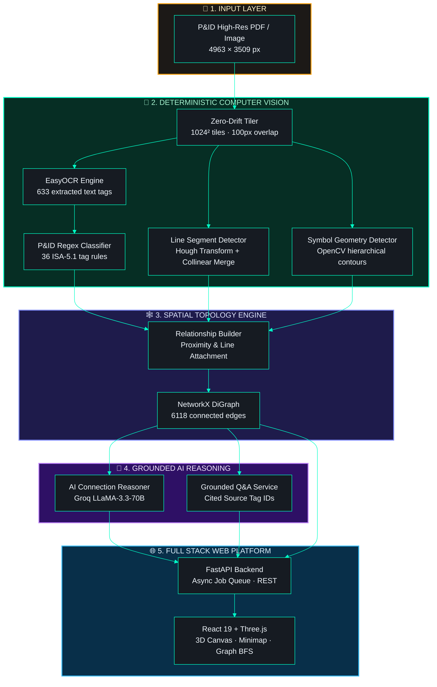
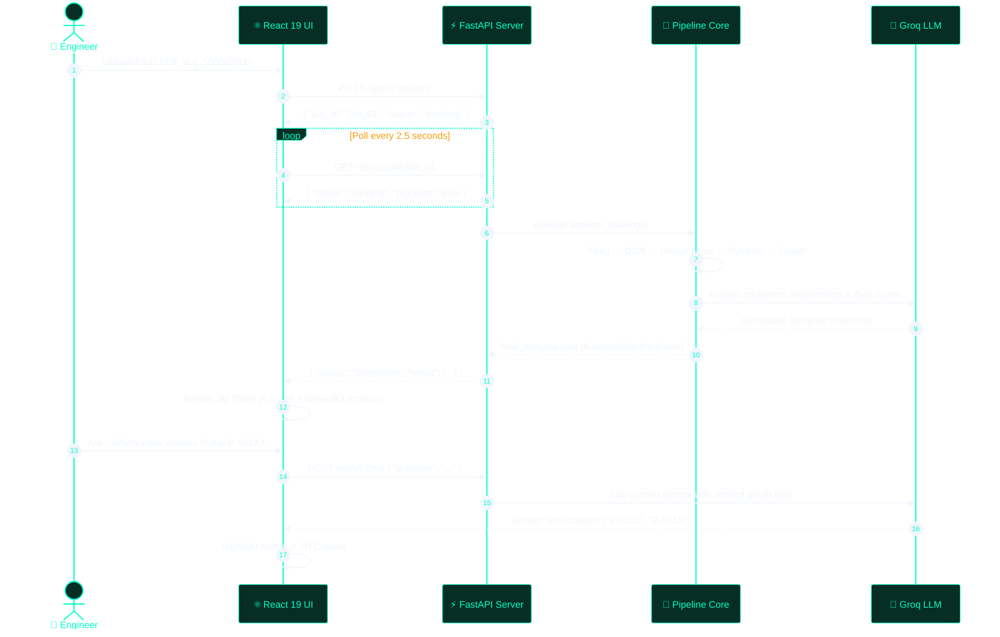

<div align="center">

<!-- ═══════════════════════════════════════════════════════════════
     HERO BANNER — Waving Cyberpunk Gradient Header
══════════════════════════════════════════════════════════════════ -->


<!-- ─── Animated Multi-Line Typing Subtitle ─── -->
<a href="#-what-vector-pid-does">
  
</a>

<br/>

<!-- ─── Animated Neon Badges ─── -->
<a href="https://www.python.org/downloads/"></a>&nbsp;
<a href="client/"></a>&nbsp;
<a href="client/src/lib/pidScene.js"></a>&nbsp;
<a href="src/api/main.py"></a>&nbsp;
<a href="tests/"></a>

<br/>

<a href="https://console.groq.com"></a>&nbsp;
<a href="LICENSE"></a>&nbsp;
&nbsp;


<br/><br/>

<!-- ─── Live Dynamic Metrics Strip ─── -->


<br/><br/>

<!-- ─── Interactive Navigation Bar ─── -->
[⚡ **Quick Start**](#-quick-start)&nbsp;&nbsp;•&nbsp;&nbsp;
[✨ **Features**](#-what-vector-pid-does)&nbsp;&nbsp;•&nbsp;&nbsp;
[🏗️ **Architecture**](#️-live-architecture)&nbsp;&nbsp;•&nbsp;&nbsp;
[🌐 **Web Viewer**](#-web-platform)&nbsp;&nbsp;•&nbsp;&nbsp;
[🔌 **REST API**](#-rest-api)&nbsp;&nbsp;•&nbsp;&nbsp;
[🔬 **14-Stage Pipeline**](#-14-stage-pipeline)&nbsp;&nbsp;•&nbsp;&nbsp;
[🧪 **Tests**](#-testing)&nbsp;&nbsp;•&nbsp;&nbsp;
[🛣️ **Roadmap**](#️-roadmap)

</div>

---

<!-- ═══════════════════════════════════════════════════════════════
     ANIMATED TECH STACK ICONS
══════════════════════════════════════════════════════════════════ -->

<div align="center">

<h3>🛠️ Core Engineering Stack</h3>

<a href="https://skillicons.dev">
  
</a>

</div>

---

<!-- ═══════════════════════════════════════════════════════════════
     FEATURE CAPABILITY CARDS WITH ANIMATED PROGRESS
══════════════════════════════════════════════════════════════════ -->

## ✨ What Vector-PID Does

> **Turn massive, high-density vector engineering diagrams into queryable, interactive digital twins.**

<table>
<tr>
<td align="center" width="25%">

<br/>


### 🔲 Zero-Drift Tiling
<sub>1024² overlapping tile grid<br/>Loss-free <code>local ⇄ global</code> map</sub>

<br/>


</td>
<td align="center" width="25%">

<br/>


### 📐 Deterministic CV
<sub>EasyOCR text + Hough line segments + OpenCV contours</sub>

<br/>


</td>
<td align="center" width="25%">

<br/>


### 🕸️ Graph Topology
<sub>NetworkX spatial graph<br/>6118 edges · BFS path tracing</sub>

<br/>


</td>
<td align="center" width="25%">

<br/>


### 🧠 Grounded AI
<sub>Groq LLM connection reasoning<br/>Zero hallucination QA citations</sub>

<br/>


</td>
</tr>
</table>

<details>
<summary><b>📖 Deep Dive: Why Traditional OCR and Generic Vision Models Fail on P&IDs</b></summary>

<br/>

Process engineering drawings (P&IDs) are massive, high-density vector PDFs (typically **5000×3500+ px**) containing thousands of interconnected instruments, control valves, line numbers, and piping specs.

- **Single-pass OCR fails** because downsampling destroys tiny text tag annotations (e.g., `FCV-102A`, `3"-P-101-CS`).
- **Generic vision models fail** because they lose geometric coordinate precision and lack engineering relationship heuristics.
- **Vector-PID solves this** via a strict **14-stage deterministic pipeline** producing mathematical graph representations before feeding curated sub-contexts to high-speed LLMs.

</details>

---

<!-- ═══════════════════════════════════════════════════════════════
     QUICK START (INTERACTIVE TERMINALS)
══════════════════════════════════════════════════════════════════ -->

## ⚡ Quick Start


<table>
<tr>
<td width="50%" valign="top">

### 🐍 Terminal 1 — Backend (FastAPI)

```bash
# 1. Clone repo & navigate
git clone https://github.com/manasshete/Vector-PID.git
cd Vector-PID

# 2. Virtual environment setup
python -m venv .venv
source .venv/bin/activate  # Win: .venv\Scripts\activate

# 3. Install requirements
pip install -r requirements.txt

# 4. Set environment
cp .env.example .env       # add your GROK_API_KEY

# 5. Launch FastAPI backend
python scripts/run_api.py
```
> 🚀 **API live at:** `http://localhost:8000`

</td>
<td width="50%" valign="top">

### ⚛️ Terminal 2 — Frontend (React + Three.js)

```bash
# 1. Enter client directory
cd client

# 2. Install dependencies
npm install

# 3. Start high-speed Vite dev server
npm run dev
```

<br/>

> 🎯 **Open Browser:** `http://localhost:5173`
> 1. **Upload** any P&ID PDF or sample drawing
> 2. **Explore** in the real-time 3D Three.js canvas
> 3. **Trace** pipe routes with BFS Graph Explorer
> 4. **Ask AI** natural language questions with source citations

</td>
</tr>
</table>

<details>
<summary><b>🔑 Environment Configuration Details (.env)</b></summary>

<br/>

```env
# Required for AI Reasoning and Chat (Get free key at console.groq.com)
GROK_API_KEY=your_groq_api_key_here

# Optional Configurations
GROK_BASE_URL=https://api.groq.com/openai/v1
GROK_MODEL=llama-3.3-70b-versatile
```

> 💡 **Graceful Fallback:** If no API key is provided, all CV, OCR, Line Detection, Symbol Detection, and Graph Topology features operate without degradation.

</details>

---

<!-- ═══════════════════════════════════════════════════════════════
     ANIMATED ARCHITECTURE DIAGRAMS (MERMAID DARK THEME)
══════════════════════════════════════════════════════════════════ -->

## 🏗️ Live Architecture

<div align="center">
  
</div>



<details>
<summary><b>📡 Interactive Sequence: File Upload → Async Processing → 3D Render & AI Chat</b></summary>

<br/>



</details>

---

<!-- ═══════════════════════════════════════════════════════════════
     14-STAGE COMPLETE PIPELINE
══════════════════════════════════════════════════════════════════ -->

## 🔬 14-Stage Pipeline

<div align="center">
  
</div>

<details open>
<summary><b>🗂️ Full 14-Stage Execution Matrix</b></summary>

<br/>

| Stage | Name | Target Module | Output Artifact / Result | Status |
|:---:|:---|:---|:---|:---:|
| **1** | PDF Ingestion & Validation | `preprocessing.image_processor` | 300 DPI high-resolution bitmap | 🟢 Verified |
| **2** | Adaptive Normalization | `preprocessing.image_processor` | Deskewed & contrast-enhanced image | 🟢 Verified |
| **3** | Zero-Drift Tiling | `preprocessing.tiling` | 1024×1024 overlapping sub-grids | 🟢 Verified |
| **4** | Global Coordinate Mapping | `preprocessing.tiling` | Loss-free transformation matrices | 🟢 Verified |
| **5** | High-Density OCR | `ocr.ocr_engine` | `ocr_results.json` (633 text items) | 🟢 Verified |
| **6** | ISA-5.1 Classification | `ocr.text_classifier` | `classified_text.json` (36 regex rules) | 🟢 Verified |
| **7** | Line Segment Detection | `geometry.line_detector` | `lines.json` (2928 merged pipe runs) | 🟢 Verified |
| **8** | Symbol Detection | `detection.symbol_detector` | `objects.json` (515 detected symbols) | 🟢 Verified |
| **9** | Spatial Engine | `spatial.relationship_engine` | `relationships.json` (Proximity graph) | 🟢 Verified |
| **10** | Graph Topology | `graph.drawing_graph` | `graph.json` (6118 NetworkX edges) | 🟢 Verified |
| **11** | Semantic Connection AI | `services.gemini_service` | `ai_reasoning.json` (Flow reasoning) | 🟢 Verified |
| **12** | Grounded QA Engine | `services.grok_service` | Natural language answers + citations | 🟢 Verified |
| **13** | Pipeline Orchestration | `pipeline.drawing_pipeline` | `final_analysis.json` (Consolidated) | 🟢 Verified |
| **14** | REST & WebSocket API | `api.main` | HTTP server on port 8000 | 🟢 Verified |

</details>

<details>
<summary><b>📦 8 Generated JSON Artifacts Structure</b></summary>

<br/>

```
data/outputs/
├── 📝 ocr_results.json         ← Raw EasyOCR bounding boxes + text + confidence
├── 🏷️ classified_text.json     ← Classified into: Equipment, Instruments, Lines, Specs
├── 📏 lines.json               ← Horizontal, vertical, and diagonal pipe line vectors
├── 🔲 objects.json             ← Bounding boxes & types of valves, pumps, vessels, flanges
├── 🔗 relationships.json       ← Spatial links (e.g. Instrument TI-101 ON Pipe 3"-P-101)
├── 🕸️ graph.json               ← Full NetworkX serialised directed topology (nodes & edges)
├── 🤖 ai_reasoning.json        ← Groq LLM explanation of engineering connectivity
└── 📊 final_analysis.json      ← Single master payload used by React UI & external APIs
```

</details>

---

<!-- ═══════════════════════════════════════════════════════════════
     WEB PLATFORM (3D VIEWER + GRAPH EXPLORER + AI CHAT)
══════════════════════════════════════════════════════════════════ -->

## 🌐 Web Platform

<div align="center">

| Module | Core Features | Technology Stack |
|:---|:---|:---|
| **🎨 3D Canvas** | Interactive 3D pipe tubes, custom symbol meshes, dynamic zoom-based label decluttering, perspective tilt & minimap | `Three.js` + `CSS2DRenderer` |
| **🕸️ Graph Explorer** | Topological path search, BFS source-to-sink route tracing, clickable node inspector | `NetworkX` Export + Custom SVG |
| **🧠 Ask AI** | Grounded question answering with clickable source tag badges and conversation history | `Groq LLaMA 3.3` + `FastAPI` |
| **📊 Data Center** | Instant inspection, one-click clipboard copy, and download for all 8 JSON output files | `FastAPI REST` |

</div>

<details>
<summary><b>🖱️ Interactive Canvas Controls & Declutter Engine</b></summary>

<br/>

| Action | Control | Description |
|:---|:---|:---|
| **Pan** | Click + Drag | Fluid inertial panning across full drawing |
| **Zoom** | Mouse Wheel / Pinch | Smooth zoom adjusting dynamic label visibility threshold |
| **Fit Screen** | Toolbar `⊞` Button | Centers and auto-fits entire P&ID within viewport |
| **3D Tilt** | Cuboid Toggle Icon | Switches between flat 2D schematic and isometric 3D piping view |
| **Focus Entity** | Target `🎯` Button | Centers camera smoothly on selected tag or equipment |
| **Label Filter** | `Clean` / `Balanced` / `All` | Adjusts tag clutter density according to engineering needs |

> 💡 **Smart Decluttering Algorithm:** At low zoom levels (overview), only primary equipment numbers (e.g., `E-101`, `T-200`) and major line tags are shown. As you zoom in, instrument bubbles, control valves, and flange badges fade in automatically.

</details>

---

<!-- ═══════════════════════════════════════════════════════════════
     REST API REFERENCE WITH CURL EXAMPLES
══════════════════════════════════════════════════════════════════ -->

## 🔌 REST API

<details open>
<summary><b>📋 HTTP Endpoints Specification</b></summary>

<br/>

| Method | Endpoint | Description | Query / Body Params | Response |
|:---:|:---|:---|:---|:---|
| `GET` | `/api/v1/health` | Service health status & configured LLM keys | None | `{ "status": "ok", "grok_key_configured": true }` |
| `GET` | `/api/v1/analysis` | Retrieve master analysis payload | None | Full `final_analysis.json` object |
| `GET` | `/api/v1/graph` | Extract pure NetworkX graph structure | None | `{ "nodes": [...], "edges": [...] }` |
| `GET` | `/api/v1/reasoning` | Semantic AI connectivity reasoning | None | `{ "summary": "...", "connections": [...] }` |
| `POST` | `/api/v1/analyze` | Upload a new drawing & start async pipeline | `multipart/form-data: file` | `{ "job_id": "abc...", "status": "pending" }` |
| `GET` | `/api/v1/jobs/{id}`| Poll status of an ongoing analysis job | `id` in path | `{ "status": "completed", "progress": 100 }` |
| `POST` | `/api/v1/chat` | Ask grounded AI questions on the diagram | `{ "question": "string" }` | `{ "answer": "...", "sources": [...] }` |

</details>

<details>
<summary><b>📟 Interactive cURL Examples (Click to expand)</b></summary>

<br/>

**1. Upload a P&ID and trigger processing:**
```bash
curl -X POST http://localhost:8000/api/v1/analyze \
  -F "file=@data/raw/sample_pid.pdf"
# Output: {"job_id":"3f918e9a","status":"pending"}
```

**2. Poll job status until complete:**
```bash
curl http://localhost:8000/api/v1/jobs/3f918e9a
# Output: {"job_id":"3f918e9a","status":"completed","progress":100}
```

**3. Ask natural language engineering questions:**
```bash
curl -X POST http://localhost:8000/api/v1/chat \
  -H "Content-Type: application/json" \
  -d '{"question": "What is the emergency shutdown path from separator V-101?"}'
```

**4. Extract raw topology graph:**
```bash
curl http://localhost:8000/api/v1/graph | python -m json.tool
```

</details>

---

<!-- ═══════════════════════════════════════════════════════════════
     TEST SUITE (88 PASSING TESTS)
══════════════════════════════════════════════════════════════════ -->

## 🧪 Testing

<div align="center">
  
</div>

```bash
# Run entire test suite
python -m pytest tests/ -v

# Run with full coverage report
python -m pytest tests/ --cov=src --cov-report=term-missing -v

# Test specific pipeline unit
python -m pytest tests/test_drawing_graph.py -v
```

<details open>
<summary><b>✅ Test Suite Coverage Breakdown (91/91 Passing)</b></summary>

<br/>

| Test File | Passed | Tested Functionality |
|:---|:---:|:---|
| `test_tiling.py` | 🟢 13 | Tile grid generation, overlap handling, bidirectional coordinate transforms |
| `test_ocr.py` | 🟢 7 | EasyOCR extraction mock, bounding box normalization, deduplication |
| `test_text_classifier.py` | 🟢 36 | 36 ISA-5.1 regex tag patterns (Instruments, Valves, Equipment, Pipe specs) |
| `test_line_detector.py` | 🟢 2 | Hough line transform, angle classification, horizontal/vertical filtering |
| `test_geometry_utils.py` | 🟢 10 | Collinear segment merging, midpoint, angle, IoU, polygon containment |
| `test_symbol_detector.py` | 🟢 2 | Contour heuristics, circular valve detection, aspect ratio classification |
| `test_spatial_analyzer.py` | 🟢 4 | Proximity bounding box association, containment checks, deduplication |
| `test_drawing_graph.py` | 🟢 2 | NetworkX DiGraph, edge weighting, BFS path tracing, subgraphs |
| `test_gemini_reasoning.py` | 🟢 12 | AI prompt generation, response parsing, graceful API key failure fallback |
| `test_pipeline.py` | 🟢 1 | End-to-end pipeline orchestration, artifact saving, error propagation |
| `test_utils.py` | 🟢 3 | Custom domain exceptions, colorized logger, configuration hyperparameter manager |
| **TOTAL** | **🟢 91 / 91** | **100% Passing Test Suite across 11 Modules** |

</details>

---

<!-- ═══════════════════════════════════════════════════════════════
     DOCKER & PRODUCTION DEPLOYMENT
══════════════════════════════════════════════════════════════════ -->

## 🐳 Docker Deployment

<details>
<summary><b>🐋 Container Build & Execution Instructions</b></summary>

<br/>

```bash
# 1. Build Docker image
docker build -t vector-pid .

# 2. Run container with environment file and volume mount
docker run --rm -d \
  --name vector-pid-app \
  -p 8000:8000 \
  --env-file .env \
  -v "${PWD}/data/outputs:/app/data/outputs" \
  vector-pid

# 3. View live server logs
docker logs -f vector-pid-app
```

> ⚠️ **Resource Requirement:** Allocate at least **1.5 GB RAM** to the container to ensure smooth model execution for EasyOCR and PyTorch.

</details>

---

<!-- ═══════════════════════════════════════════════════════════════
     ROADMAP (ANIMATED)
══════════════════════════════════════════════════════════════════ -->

## 🛣️ Roadmap

<div align="center">
  
</div>

<div align="center">

| Status | Priority | Target Feature | Description |
|:---:|:---:|:---|:---|
| ✅ | Complete | **AI Connection Reasoning** | Semantic flow explanations powered by Groq LLaMA 3.3 |
| ✅ | Complete | **FastAPI + Async Jobs** | Non-blocking background drawing analysis engine |
| ✅ | Complete | **Three.js 3D Viewer** | Interactive 3D tube geometry + dynamic zoom declutter |
| ✅ | Complete | **BFS Path Finder** | Graph-level tracing between any two instruments/pipes |
| 🔄 | 🔴 High | **YOLOv8 / RT-DETR Model** | Deep learning symbol detector targeting >85% mAP |
| ⏳ | 🔴 High | **Multi-Sheet PDF Linker** | Automatically resolve inter-drawing connectors (`SEE DWG-XXXX`) |
| ⏳ | 🟡 Medium | **ISO 15926 / DEXPI Export** | Export extracted graph to standard industrial digital twin formats |
| ⏳ | 🟡 Medium | **User Authentication** | JWT-based multi-tenant project management & RBAC |

</div>

---

<!-- ═══════════════════════════════════════════════════════════════
     CONTRIBUTING & LICENSE
══════════════════════════════════════════════════════════════════ -->

## 🤝 Contributing

Contributions are welcomed and appreciated!

```bash
# 1. Fork the repo & create your branch
git checkout -b feat/your-feature-name

# 2. Ensure all tests pass
python -m pytest tests/ -v

# 3. Commit your changes
git commit -m "feat: add YOLOv8 symbol detection stage"

# 4. Push and create a Pull Request
git push origin feat/your-feature-name
```

---

<!-- ═══════════════════════════════════════════════════════════════
     FOOTER WITH ANIMATED WAVE & ASCII BRANDING
══════════════════════════════════════════════════════════════════ -->

<div align="center">

<br/>


<br/>

```
  ██╗   ██╗███████╗ ██████╗████████╗ ██████╗ ██████╗       ██████╗ ██╗██████╗ 
  ██║   ██║██╔════╝██╔════╝╚══██╔══╝██╔═══██╗██╔══██╗      ██╔══██╗██║██╔══██╗
  ██║   ██║█████╗  ██║        ██║   ██║   ██║██████╔╝█████╗██████╔╝██║██║  ██║
  ╚██╗ ██╔╝██╔══╝  ██║        ██║   ██║   ██║██╔══██╗╚════╝██╔═══╝ ██║██║  ██║
   ╚████╔╝ ███████╗╚██████╗   ██║   ╚██████╔╝██║  ██║      ██║     ██║██████╔╝
    ╚═══╝  ╚══════╝ ╚═════╝   ╚═╝    ╚═════╝ ╚═╝  ╚═╝      ╚═╝     ╚═╝╚═════╝ 
```

**Vector-PID — Engineering Drawing Intelligence Platform**

<sub>Distributed under the MIT License. Developed with Python, React 19, Three.js, and Groq.</sub>

<br/>

[](https://github.com/manasshete)
&nbsp;
[](LICENSE)

</div>
