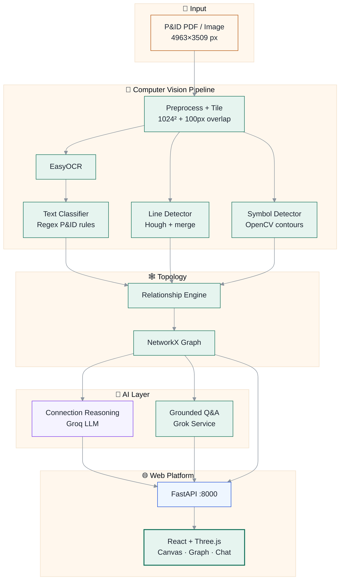
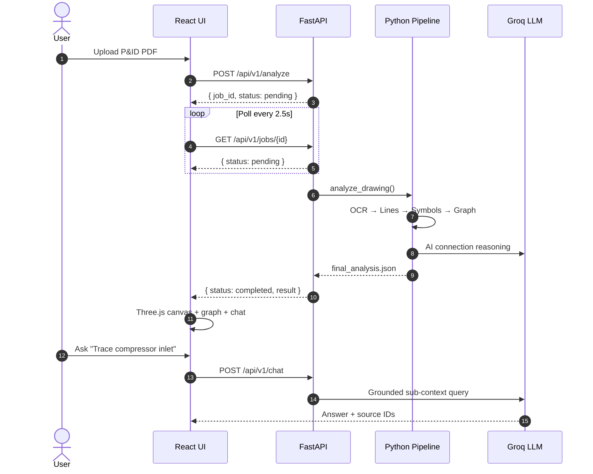

<div align="center">

<!-- Animated header banner -->


<!-- Typing animation subtitle -->


<br/>

<!-- Badges -->
[](https://www.python.org/downloads/)
[](client/)
[](client/src/lib/pidScene.js)
[](src/api/main.py)
[](tests/)
[](LICENSE)

<br/>

**Turn static P&IDs into queryable digital twins** — computer vision + graph topology + grounded LLM reasoning.

<br/>

[](#-quick-start-30-seconds)
&nbsp;•&nbsp;
[](#️-live-architecture)
&nbsp;•&nbsp;
[](#-web-platform)
&nbsp;•&nbsp;
[](#-rest-api)
&nbsp;•&nbsp;
[](#-testing)

<br/>

<!-- Animated stats bar -->


</div>

---

## ⚡ Quick Start (30 seconds)

<table>
<tr>
<td width="50%" valign="top">

**🐍 Terminal 1 — API**
```bash
git clone https://github.com/manasshete/Vector-PID.git
cd Vector-PID
python -m venv .venv
source .venv/bin/activate   # Win: .venv\Scripts\activate
pip install -r requirements.txt
cp .env.example .env        # add GROK_API_KEY
python scripts/run_api.py
```

</td>
<td width="50%" valign="top">

**⚛️ Terminal 2 — UI**
```bash
cd client
npm install
npm run dev
```

Open `http://localhost:5173` → **Upload** a P&ID → explore in 3D canvas.

</td>
</tr>
</table>

---

## 🏗️ Live Architecture

> Renders interactively on GitHub — click nodes to explore in supported viewers.



<details>
<summary><b>📡 Upload → Analyze sequence (click to expand)</b></summary>



</details>

---

## 🎯 What It Does

<table>
<tr>
<td align="center" width="25%">
<h3>🔲</h3>
<b>Zero-Drift Tiling</b><br/>
<sub>1024² tiles · loss-free coords</sub>
</td>
<td align="center" width="25%">
<h3>📐</h3>
<b>Deterministic CV</b><br/>
<sub>OCR · Hough lines · contours</sub>
</td>
<td align="center" width="25%">
<h3>🕸️</h3>
<b>Graph Topology</b><br/>
<sub>NetworkX · BFS tracing</sub>
</td>
<td align="center" width="25%">
<h3>🧠</h3>
<b>Grounded AI</b><br/>
<sub>Groq LLM · 0-hallucination</sub>
</td>
</tr>
</table>

<details>
<summary><b>📖 Executive Summary — full details</b></summary>

<br/>

Process engineering drawings (P&IDs) are massive, high-density vector PDFs (often **5000×3500+** pixels) containing thousands of interconnected components, instruments, line numbers, and annotations.

Traditional single-pass OCR and generic vision models fail due to memory limits, text scaling, and loss of geometric context. **Vector-PID** solves this with a strict **14-stage pipeline**:

| # | Stage | What it does |
|:-:|-------|-------------|
| 1 | **Zero-Drift Tiling** | Overlapping 1024×1024 tiles with bidirectional `local ⇄ global` mapping |
| 2 | **Deterministic Extraction** | EasyOCR text, Hough lines, OpenCV symbol contours |
| 3 | **Spatial Topology** | Annotates symbols, connects lines, builds NetworkX graph |
| 4 | **AI Connection Reasoning** | Groq LLM explains *why* components connect and traces process flows |
| 5 | **Grounded Q&A** | Sub-context retrieval — no hallucinated tags |
| 6 | **Web Viewer** | Three.js canvas + graph explorer + live chat |

</details>

---

## 🌐 Web Platform

<div align="center">

| Tab | Feature | Tech |
|:---:|:--------|:-----|
| **Canvas** | 3D pipe tubes, symbol meshes, zoom-based label declutter, minimap | Three.js + CSS2D |
| **Graph** | BFS path tracer, searchable node directory | NetworkX export |
| **Ask AI** | Grounded Groq Q&A with cited source IDs | GrokService |
| **Data** | 8 JSON artifacts — copy / download | FastAPI |

</div>

<details>
<summary><b>🖱️ Canvas controls & label density</b></summary>

<br/>

| Action | Control |
|--------|---------|
| Pan | Drag |
| Zoom | Scroll wheel |
| Fit drawing | Toolbar ⊞ button |
| 3D tilt | Cuboid toggle |
| Focus selection | Target button |
| Jump to entity | Sidebar search |
| Label clutter | **Clean** / Balanced / All density modes |

> At overview zoom, only high-priority tags (instrument, equipment, line numbers) are shown. Zoom in to reveal more. Symbol badges (FLANGE, etc.) appear only when zoomed in.

</details>

---

## 🔌 REST API

<details open>
<summary><b>📋 Endpoint reference (click to collapse)</b></summary>

<br/>

| Method | Endpoint | Description |
|:------:|:---------|:------------|
| `GET` | `/api/v1/health` | Server status + keys configured |
| `GET` | `/api/v1/analysis` | Full `final_analysis.json` |
| `GET` | `/api/v1/graph` | NetworkX graph only |
| `GET` | `/api/v1/reasoning` | AI connection reasoning JSON |
| `POST` | `/api/v1/analyze` | Upload file → `{ job_id }` |
| `GET` | `/api/v1/jobs/{id}` | Poll pipeline job |
| `POST` | `/api/v1/chat` | `{ "question": "..." }` → grounded answer |

**Upload & poll:**
```bash
curl -X POST http://localhost:8000/api/v1/analyze \
  -F "file=@data/raw/your-drawing.pdf"

curl http://localhost:8000/api/v1/jobs/<job_id>
```

**Chat:**
```bash
curl -X POST http://localhost:8000/api/v1/chat \
  -H "Content-Type: application/json" \
  -d '{"question":"List all equipment tags"}'
```

</details>

---

## 🔬 Pipeline (Steps 1–14)

<details>
<summary><b>🗂️ Click to expand full pipeline table</b></summary>

<br/>

| Stage | Module | Output |
|:-----:|:-------|:-------|
| 1–2 | `preprocessing.image_processor` | Clean high-res image |
| 3–4 | `preprocessing.tiling` | 1024² tile grid |
| 5 | `ocr.ocr_engine` | `ocr_results.json` |
| 6 | `ocr.text_classifier` | `classified_text.json` |
| 7 | `geometry.line_detector` | `lines.json` |
| 8 | `detection.symbol_detector` | `objects.json` |
| 9 | `spatial.relationship_engine` | `relationships.json` |
| 10 | `graph.drawing_graph` | `graph.json` |
| 11 | `services.gemini_service` | `ai_reasoning.json` |
| 12 | `services.grok_service` | Grounded QA |
| 13 | `pipeline.drawing_pipeline` | `final_analysis.json` |
| 14 | `api.main` | REST over HTTP |

</details>

<details>
<summary><b>📊 JSON artifacts (8 files)</b></summary>

<br/>

```
data/outputs/
├── ocr_results.json
├── classified_text.json
├── lines.json
├── objects.json
├── relationships.json
├── graph.json
├── ai_reasoning.json      ← AI connection explanations
└── final_analysis.json    ← consolidated payload
```

</details>

---

## 🛠️ Installation

<details>
<summary><b>📦 Prerequisites & setup (click to expand)</b></summary>

<br/>

**Prerequisites**
- Python 3.10+
- Node.js 18+
- Poppler (`poppler-utils` / `brew install poppler` / Windows binaries in PATH)

**Setup**
```bash
git clone https://github.com/manasshete/Vector-PID.git && cd Vector-PID
python -m venv .venv && source .venv/bin/activate
pip install -r requirements.txt
cd client && npm install && cd ..
cp .env.example .env
```

**`.env`**
```env
GROK_API_KEY=your_groq_api_key_here
GROK_BASE_URL=https://api.groq.com/openai/v1
GROK_MODEL=llama-3.3-70b-versatile
```

</details>

<details>
<summary><b>🚀 CLI usage — individual pipeline stages</b></summary>

<br/>

```bash
# Full pipeline
python scripts/11_end_to_end_pipeline.py

# Individual stages
python scripts/05_text_classification.py
python scripts/06_line_detection.py
python scripts/07_symbol_detection.py
python scripts/08_spatial_reasoning.py
python scripts/09_graph_construction.py
python scripts/10_grok_analysis.py
```

</details>

---

## 📁 Repository Structure

<details>
<summary><b>🗃️ Click to expand tree</b></summary>

<br/>

```text
engineering-drawing-intelligence/
├── src/
│   ├── api/              # FastAPI REST server
│   ├── detection/        # Symbol detector
│   ├── geometry/         # Line detector
│   ├── graph/            # NetworkX topology
│   ├── ocr/              # EasyOCR + classifier
│   ├── pipeline/         # analyze_drawing()
│   ├── preprocessing/    # PDF load + tiling
│   ├── services/         # Grok + AI reasoning
│   └── spatial/          # Relationship engine
├── client/               # React + Three.js UI
│   └── src/lib/pidScene.js
├── scripts/              # CLI + run_api.py
├── tests/                # 88 pytest tests
└── data/
    ├── raw/              # Input P&IDs
    └── outputs/          # JSON artifacts
```

</details>

---

## 🧪 Testing

```bash
python -m pytest tests/ -v
```

<details>
<summary><b>✅ Test suite breakdown (88 passed)</b></summary>

<br/>

| Module | Coverage |
|--------|----------|
| `test_geometry_utils.py` | Line math, collinear merge |
| `test_line_detector.py` | Hough + orientation |
| `test_symbol_detector.py` | Contour heuristics |
| `test_spatial_analyzer.py` | Proximity + dedup |
| `test_drawing_graph.py` | NetworkX + BFS trace |
| `test_pipeline.py` | End-to-end orchestration |
| `test_text_classifier.py` | 36 regex P&ID rules |
| `test_gemini_reasoning.py` | AI reasoning models |
| `test_ocr.py` | BBox coordinate transforms |
| `test_tiling.py` | Zero-drift tile mapping |

</details>

---

## ⚠️ Limitations

<details>
<summary><b>🔍 Honesty disclosures (click to expand)</b></summary>

<br/>

| Component | Reality |
|-----------|---------|
| **Symbol detector** | OpenCV contours — **<40% mAP** on dense P&IDs. Baseline only; needs YOLOv8/RT-DETR for production. |
| **Line detector** | Hough transform — great for straight pipes, weak on signal/tubing distinction. |
| **LLM pacing** | Groq free tier ~30 RPM — sub-context filtering + backoff retry built in. |
| **AI reasoning** | Quality depends on upstream OCR/symbol accuracy. Skips gracefully without API key. |

</details>

---

## 🐳 Docker

<details>
<summary><b>🐋 Container deployment</b></summary>

<br/>

```bash
docker build -t vector-pid .
docker run --rm --env-file .env \
  -v "${PWD}/data/outputs:/app/data/outputs" vector-pid
```

Allocate **≥ 1.5 GB RAM** for EasyOCR/PyTorch.

</details>

---

## 🛣️ Roadmap

<div align="center">

| Status | Item |
|:------:|:-----|
| ✅ | AI connection reasoning (Groq LLM) |
| ✅ | FastAPI REST server + job polling |
| ✅ | React Three.js canvas UI |
| ⬜ | YOLOv8 / RT-DETR symbol detector (>85% mAP) |
| ⬜ | Multi-sheet PDF linker (`SEE DWG-XXXX`) |
| ⬜ | Production auth + CORS |

</div>

---

<div align="center">

<br/>

<!-- Footer wave -->


<br/>

[](https://github.com/manasshete)
[](LICENSE)

**Vector-PID** — Engineering Drawing Intelligence Platform

<sub>MIT License · Python-First · Full Stack</sub>

</div>
